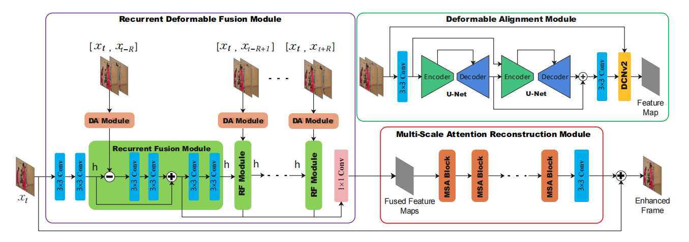
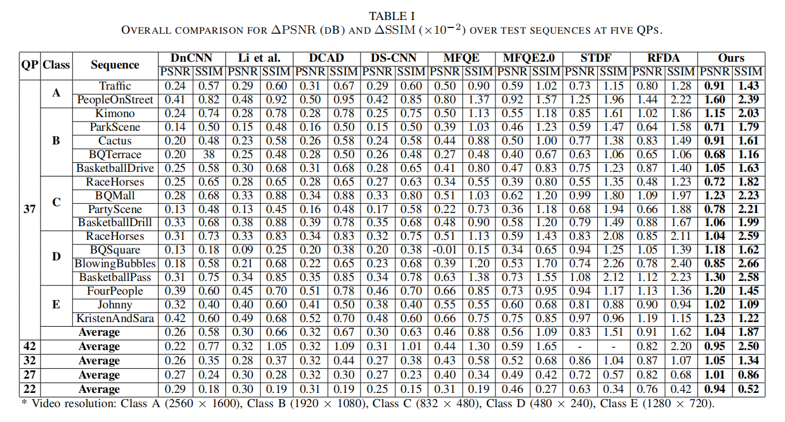

# *Recurrent Deformable Fusion for Compressed Video Artifact Reduction*


The *official* implementation for the Recurrent Deformable Fusion for Compressed Video Artifact Reduction which is accepted by [ISCAS 2022].

Task: Video Quality Enhancement / Video Artifact Reduction.




Feel free to contact: <pengliuhan@foxmail.com>.

## 1. Pre-request

### 1.1. Environment
Suppose that you have installed CUDA 10.1, then:
```bash
conda create -n cvlab python=3.7 -y  
conda activate cvlab
git clone --depth=1 https://github.com/pengliuhan/RDFN && cd RDFN/
python -m pip install torch==1.6.0+cu101 torchvision==0.7.0+cu101 -f https://download.pytorch.org/whl/torch_stable.html
python -m pip install tqdm lmdb pyyaml opencv-python scikit-image
```

### 1.2. DCNv2

Build DCNv2

```bash
cd ops/dcn/
bash build.sh
```

Check if DCNv2 works (optional)

```bash
python simple_check.py
```

> The DCNv2 source files here is different from the [open-sourced version](https://github.com/chengdazhi/Deformable-Convolution-V2-PyTorch) due to incompatibility. [[issue]](https://github.com/open-mmlab/mmediting/issues/84#issuecomment-644974315)

### 1.3. Dataset

Please check [here](https://github.com/ryanxingql/mfqev2.0/wiki/MFQEv2-Dataset).

### 1.4. Create LMDB
We now generate LMDB to speed up IO during training.
```bash
python create_lmdb_mfqev2.py
```

## 2. Train

We utilize 2 NVIDIA 2080Ti GPUs for training.
```bash
CUDA_VISIBLE_DEVICES=0,1 python -m torch.distributed.launch --nproc_per_node=2 --master_port=12390 train.py --opt_path option_R3_mfqev2_2G.yml
```

## 3. Test
We utilize 1 NVIDIA 2080Ti GPU for testing.
```bash
python test_one_video.py
```
## 4. Result



## Acknowledgements
This work is based on [STDF-Pytoch](https://github.com/RyanXingQL/STDF-PyTorch). Thank [RyanXingQL](https://github.com/RyanXingQL)  for sharing the codes.
